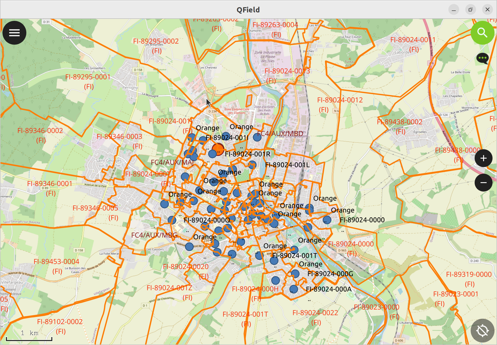
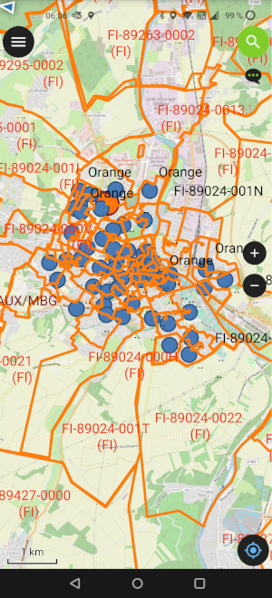
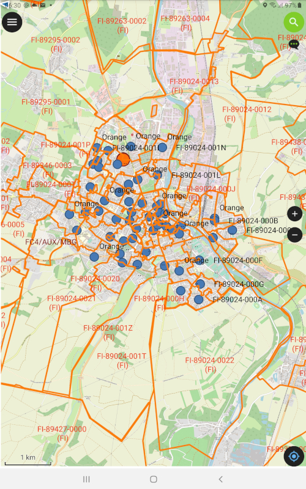
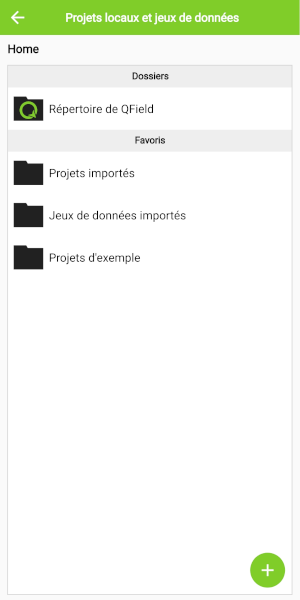
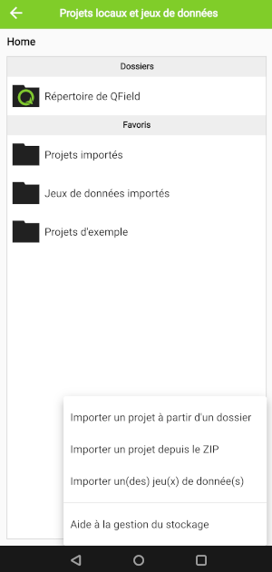
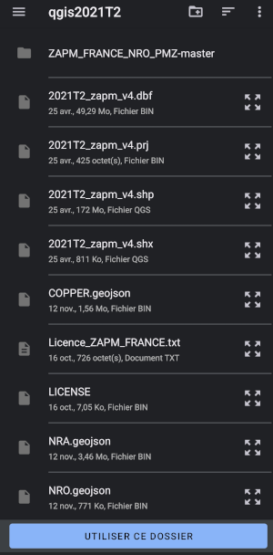
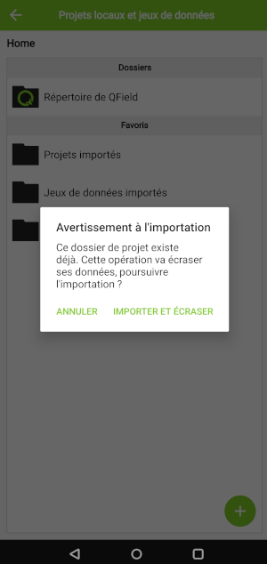
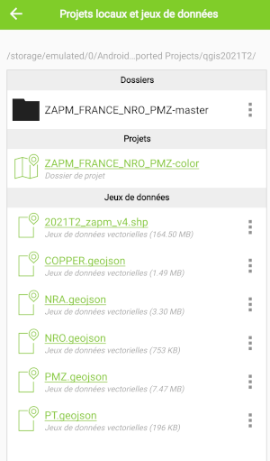
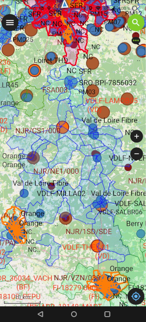

# **Utilisation de QField pour visualiser les fichiers sur une carte**

Pour visualiser les fichiers sur une carte interactive sur l'écran d'un smartphone ou d'une tablette, il suffit d'utiliser l'application [QField](https://docs.qfield.org/get-started/#__tabbed_1_1) disponible sur plusieurs plateformes (Android, iOS, MacOS, Windows, Linux).

Aperçu de QField sur différents OS:

*QField Linux* 

*QField Android smartphone et Tablette*

 

L'écran d'accueil de QField permet d'*ouvrir un fichier local* (projet avec ses fichiers préalablement dézippés dans un même dossier).

Utiliser '+' puis 'importer à partir d'un dossier', puis choisir le dossier ... et 'importer et écraser' et enfin cliquer sur le projet dans la liste des Projets pour l'afficher.

 

